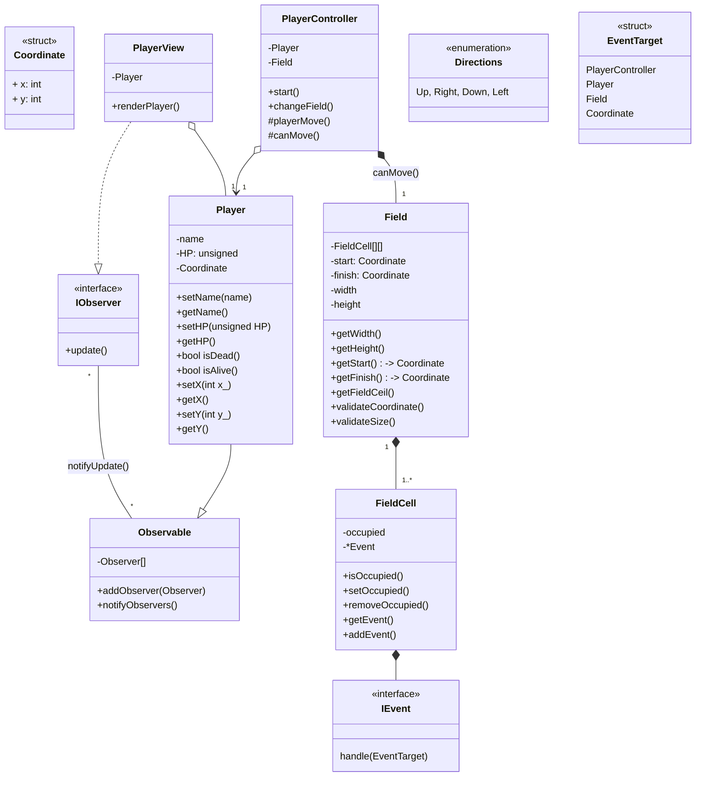

```mermaid
---
Title: Class diagram
---
classDiagram
    class Coordinate {
        <<struct>>
        + x: int
        + y: int
    }
    class PlayerController {
        +start()
        -Player
        -Field
        +changeField()
        #playerMove()
        #canMove()
    }
    class Observable {
        +addObserver(Observer)
        +notifyObservers()
        -Observer[]
    }
    class IObserver {
        <<interface>>
        +update()
    }
    class Player {
        -name
        -HP: unsigned
        -Coordinate
        +setName(name)
        +getName()
        +setHP(unsigned HP)
        +getHP()
        +bool isDead()
        +bool isAlive()
        +setX(int x_)
        +getX()
        +setY(int y_)
        +getY()
    }
    class PlayerView {
        -Player
        +renderPlayer()
    }
    class Directions {
        <<enumeration>>
        Up, Right, Down, Left
    }
    class FieldCell {
        -occupied
        -*Event
        +isOccupied()
        +setOccupied()
        +removeOccupied()
        +getEvent()
        +addEvent()
    }
    class Field {
        -FieldCell[][]
        -start: Coordinate
        -finish: Coordinate
        -width
        -height
        +getWidth()
        +getHeight()
        +getStart() -> Coordinate
        +getFinish() -> Coordinate
        +getFieldCeil()
        +validateCoordinate()
        +validateSize()
    }
    class IEvent {
        <<interface>>
        handle(EventTarget)
    }
    class EventTarget{
        <<struct>>
        PlayerController
        Player
        Field
        Coordinate
    }

    Player --|> Observable
    IObserver "*" -- "*" Observable: notifyUpdate()
    PlayerView ..|> IObserver
    PlayerView o-- "1" Player
    PlayerController o--> "1" Player
    Field "1" *-- "1..*" FieldCell
    PlayerController *-- "1" Field: canMove()

    FieldCell *-- IEvent

```
