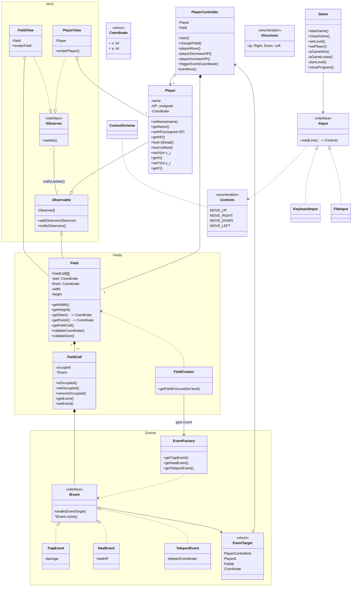
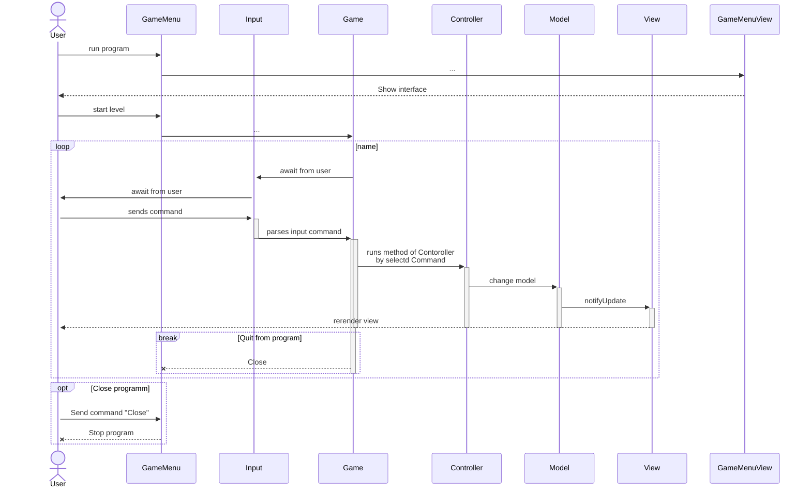

# Class diagram

```mermaid
---
Title: Class diagram
---
classDiagram
    class Coordinate {
        <<struct>>
        + x: int
        + y: int
    }

    class PlayerController {
        +start()
        -Player
        -Field
        +changeField()
        +playerMove()
        +playerDecreaseHP()
        +playerIncreaseHP()
        +triggerEvent(Coordinate)
        #canMove()
    }

    namespace MVC {
        class FieldView {
            -Field
            +renderField
        }
        class PlayerView {
            -Player
            +renderPlayer()
        }
        class Observable {
            +addObserver(Observer)
            +notifyObservers()
            -Observer[]
        }
        class IObserver {
            <<interface>>
            +update()
        }
    }
    class Player {
        -name
        -HP: unsigned
        -Coordinate
        +setName(name)
        +getName()
        +setHP(unsigned HP)
        +getHP()
        +bool isDead()
        +bool isAlive()
        +setX(int x_)
        +getX()
        +setY(int y_)
        +getY()
    }

    class Directions {
        <<enumeration>>
        Up, Right, Down, Left
    }
    namespace Fields {
        class FieldCreator {
            +getFieldForLevel(int level)
        }
        class FieldCell {
            -occupied
            -*Event
            +isOccupied()
            +setOccupied()
            +removeOccupied()
            +getEvent()
            +setEvent()
        }
        class Field {
            -FieldCell[][]
            -start: Coordinate
            -finish: Coordinate
            -width
            -height
            +getWidth()
            +getHeight()
            +getStart() -> Coordinate
            +getFinish() -> Coordinate
            +getFieldCell()
            +validateCoordinate()
            +validateSize()
        }
    }
    namespace Events {
        class IEvent {
            <<interface>>
            handle(EventTarget)
            *IEvent clone()
        }
        class EventTarget {
            <<struct>>
            PlayerController&
            Player&
            Field&
            Coordinate
        }

        class TrapEvent {
            -damage
        }
        class HealEvent {
            -healHP
        }
        class TeleportEvent {
            -teleportCoordinate
        }
        class EventFactory {
            +getTrapEvent()
            +getHealEvent()
            +getTeleportEvent()
        }
    }
    class Game {
        +startGame()
        +closeGame()
        +setLevel()
        +setPlayer()
        -isGameWin()
        -isGameLoose()
        -startLevel()
        +closeProgram()
    }
    class IInput {
        <<interface>>
        +readLine() -> Controls
    }

    class KeyboardInput {
    }

    class Controls {
        <<enumeration>>
        MOVE_UP
        MOVE_RIGHT
        MOVE_DOWN
        MOVE_LEFT
    }

    Player --|> Observable
    IObserver "*" -- "*" Observable: notifyUpdate()
    PlayerView ..|> IObserver
    PlayerView o-- "1" Player
    PlayerController o--> "1" Player
    Field "1" *-- "1..*" FieldCell
    PlayerController *-- "1" Field
    FieldCell *-- IEvent
    IEvent <|.. TrapEvent
    IEvent <|.. HealEvent
    IEvent <|.. TeleportEvent
    IEvent --> EventTarget
    FieldCreator --> EventFactory: gets Event
    EventFactory ..> IEvent
    Field <.. FieldCreator
%%    TrapEvent --> PlayerController: playerDecreaseHP()
%%    HealEvent --> PlayerController: playerIncreaseHP()
%%    TeleportEvent --> PlayerController: playerMove()

%%    PlayerController "triggerEvent" -->"handle()" IEvent: 
    EventTarget o--> PlayerController
    FieldView o-- Field
    FieldView ..|> IObserver
    Observable <|-- Field
    IInput ..> Controls
    Game --> IInput
    IInput <|.. KeyboardInput
    IInput <|.. FileInput
    ControlScheme .. Controls

```

```mermaid
sequenceDiagram
    actor User
    participant GameMenu
    participant Input
    participant Game
    participant Controller
    participant Model
    participant View
    User ->> GameMenu: run program
    GameMenu ->> GameMenuView: ...
    GameMenuView -->> User: Show interface
    User ->> GameMenu: start level
    GameMenu ->> Game: ...
    loop name
        Game ->>+ Input: await from user
        Input ->>+ User: await from user
        User ->>+ Input: sends command
        Input ->>+ Game: parses input command
        deactivate Input
        activate Game
        Game ->>+ Controller: runs method of Contoroller<br> by selectd Command
        Controller ->>+ Model: change model
        Model ->>+ View: notifyUpdate
        View -->>- User: rerender view
        deactivate Controller
        deactivate Model
        deactivate Game

        break Quit from program
            Game --x GameMenu: Close


        end
        deactivate Game

    end

    opt Close programm
        User ->> GameMenu: Send command "Close"
        GameMenu --x User: Stop program
    end
```
