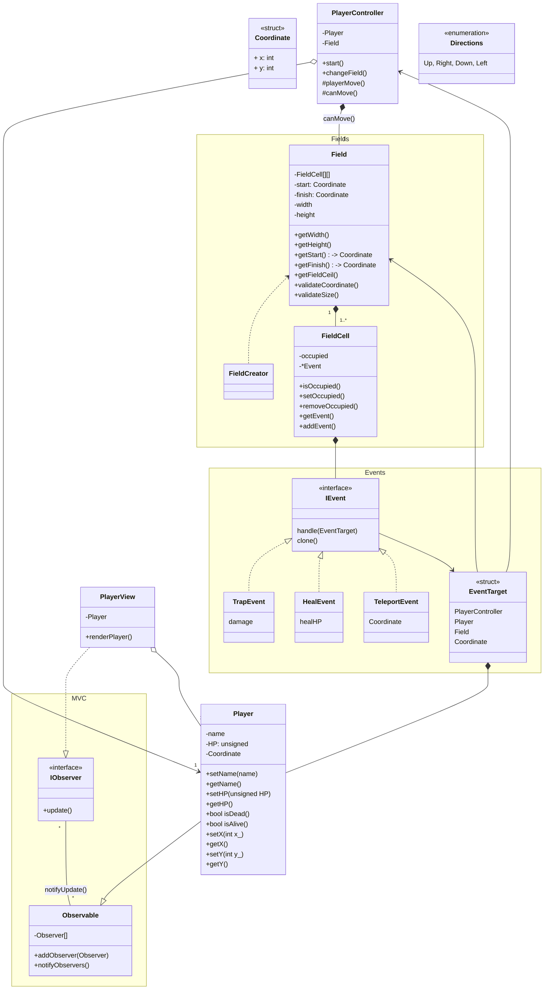

```mermaid
---
Title: Class diagram
---
classDiagram
    class Coordinate {
        <<struct>>
        + x: int
        + y: int
    }
    class PlayerController {
        +start()
        -Player
        -Field
        +changeField()
        #playerMove()
        #canMove()
    }
    namespace MVC {
        class Observable {
            +addObserver(Observer)
            +notifyObservers()
            -Observer[]
        }
        class IObserver {
            <<interface>>
            +update()
        }
    }
    class Player {
        -name
        -HP: unsigned
        -Coordinate
        +setName(name)
        +getName()
        +setHP(unsigned HP)
        +getHP()
        +bool isDead()
        +bool isAlive()
        +setX(int x_)
        +getX()
        +setY(int y_)
        +getY()
    }
    class PlayerView {
        -Player
        +renderPlayer()
    }
    class Directions {
        <<enumeration>>
        Up, Right, Down, Left
    }
    namespace Fields {
        class FieldCreator
        class FieldCell {
            -occupied
            -*Event
            +isOccupied()
            +setOccupied()
            +removeOccupied()
            +getEvent()
            +addEvent()
        }
        class Field {
            -FieldCell[][]
            -start: Coordinate
            -finish: Coordinate
            -width
            -height
            +getWidth()
            +getHeight()
            +getStart() -> Coordinate
            +getFinish() -> Coordinate
            +getFieldCeil()
            +validateCoordinate()
            +validateSize()
        }
    }
    Field <.. FieldCreator
    namespace Events {
        class IEvent {
            <<interface>>
            handle(EventTarget)
            clone()
        }
        class EventTarget {
            <<struct>>
            PlayerController
            Player
            Field
            Coordinate
        }

        class TrapEvent {
            damage
        }
        class HealEvent {
            healHP
        }
        class TeleportEvent {
            Coordinate
        }
    }

    Player --|> Observable
    IObserver "*" -- "*" Observable: notifyUpdate()
    PlayerView ..|> IObserver
    PlayerView o-- "1" Player
    PlayerController o--> "1" Player
    Field "1" *-- "1..*" FieldCell
    PlayerController *-- "1" Field: canMove()
    FieldCell *-- IEvent
    IEvent <|.. TrapEvent
    IEvent <|.. HealEvent
    IEvent <|.. TeleportEvent
    IEvent --> EventTarget
    EventTarget --> PlayerController
    EventTarget *-- Player
    EventTarget --> Field


```
