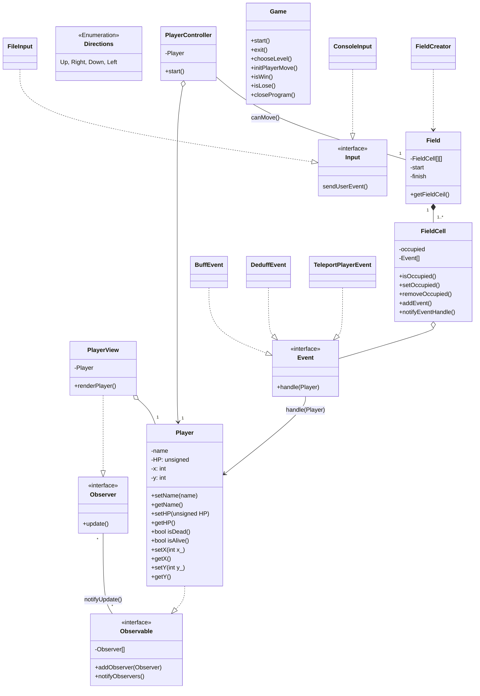

```mermaid
---
Title: Class diagram
---
classDiagram
    class PlayerController {
        +start()
        -Player
    }
    class Observable {
        <<interface>>
        +addObserver(Observer)
        +notifyObservers()
        -Observer[]
    }
    class Observer {
        <<interface>>
        +update()
    }
    class Player {
        -name
        -HP: unsigned
        -x: int
        -y: int
        +setName(name)
        +getName()
        +setHP(unsigned HP)
        +getHP()
        +bool isDead()
        +bool isAlive()
        +setX(int x_)
        +getX()
        +setY(int y_)
        +getY()
    }
    class PlayerView {
        -Player
        +renderPlayer()
    }
    class Directions {
        <<Enumeration>>
        Up, Right, Down, Left
    }
    class FieldCell {
        -occupied
        -Event[]
        +isOccupied()
        +setOccupied()
        +removeOccupied()
        +addEvent()
        +notifyEventHandle()
    }
    class Field {
        -FieldCell[][]
        -start
        -finish
        +getFieldCeil()
    }

    class Event {
        <<interface>>
        +handle(Player)
    }
    class BuffEvent
    class DeduffEvent
    class TeleportPlayerEvent

    class FieldCreator

    class Game {
        +start()
        +exit()
        +chooseLevel()
        +initPlayerMove()
        +isWin()
        +isLose()
        +closeProgram()
    }
    class Input {
        <<interface>>
        sendUserEvent()
    }
    class ConsoleInput
    class FileInput

    Player ..|> Observable
    Observer "*" -- "*" Observable: notifyUpdate()
    PlayerView ..|> Observer
    PlayerView o-- "1" Player
    PlayerController o--> "1" Player
    Field "1" *-- "1..*" FieldCell
    PlayerController -- "1" Field: canMove()
    FieldCell o-- Event
    BuffEvent ..|> Event
    DeduffEvent ..|> Event
    TeleportPlayerEvent ..|> Event
    Event --> Player: handle(Player)
    FieldCreator ..> Field
    FileInput ..|> Input
    ConsoleInput ..|> Input
%%    class Message
%%    class Enemy~T::ControllScheme, 
%%    R::PlayerCommunicationScheme~


```
