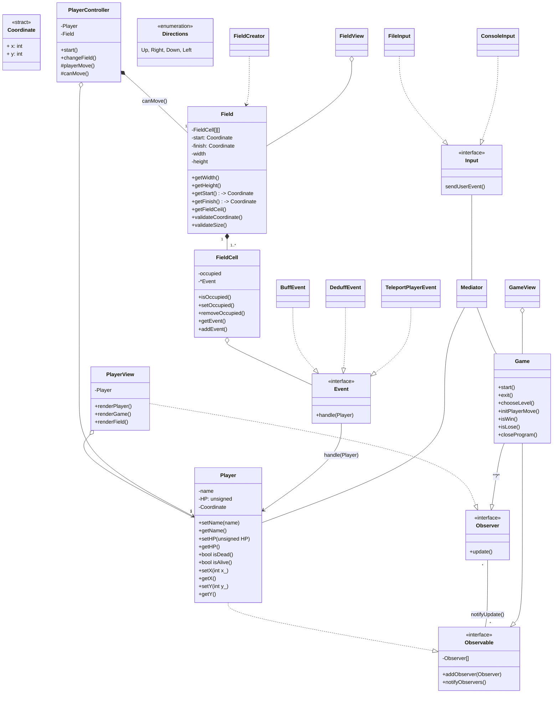
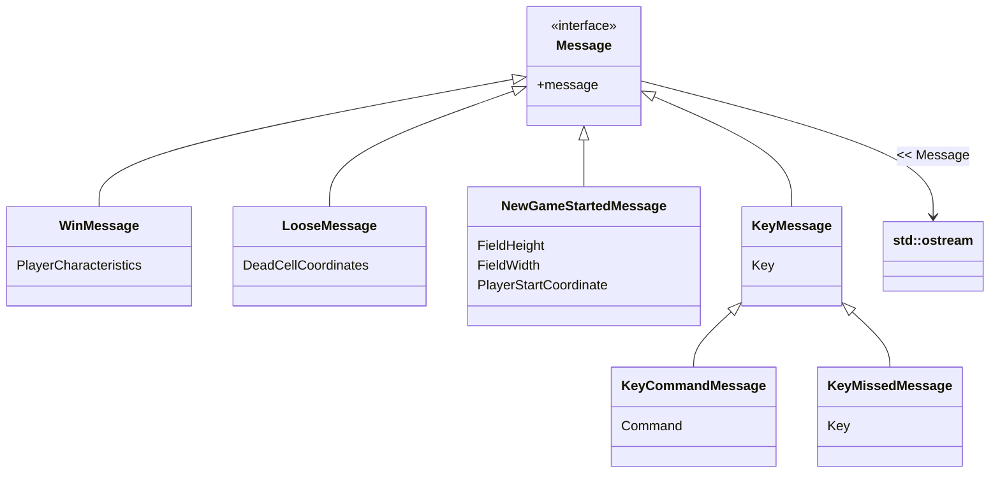
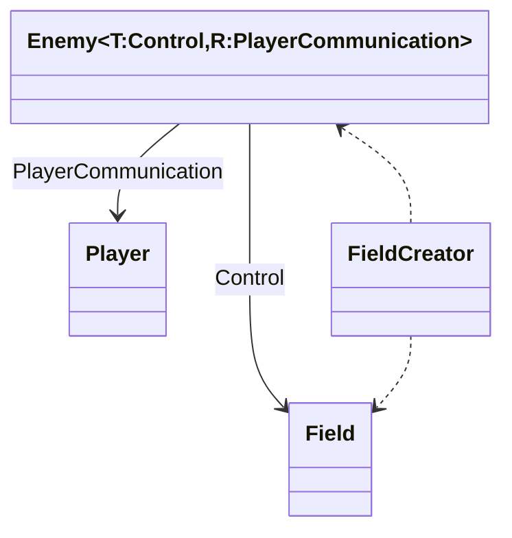

# Будущее

```mermaid
---
Title: Class diagram
---
classDiagram
    class Coordinate {
        <<stract>>
        + x: int
        + y: int
    }
    class PlayerController {
        +start()
        -Player
        -Field
        +changeField()
        #playerMove()
        #canMove()
    }
    class Observable {
        <<interface>>
        +addObserver(Observer)
        +notifyObservers()
        -Observer[]
    }
    class Observer {
        <<interface>>
        +update()
    }
    class Player {
        -name
        -HP: unsigned
        -Coordinate
        +setName(name)
        +getName()
        +setHP(unsigned HP)
        +getHP()
        +bool isDead()
        +bool isAlive()
        +setX(int x_)
        +getX()
        +setY(int y_)
        +getY()
    }
    class PlayerView {
        -Player
        +renderPlayer()
        +renderGame()
        +renderField()
    }
    class Directions {
        <<enumeration>>
        Up, Right, Down, Left
    }
    class FieldCell {
        -occupied
        -*Event
        +isOccupied()
        +setOccupied()
        +removeOccupied()
        +getEvent()
        +addEvent()
    }
    class Field {
        -FieldCell[][]
        -start: Coordinate
        -finish: Coordinate
        -width
        -height
        +getWidth()
        +getHeight()
        +getStart() -> Coordinate
        +getFinish() -> Coordinate
        +getFieldCeil()
        +validateCoordinate()
        +validateSize()
    }

    class Event {
        <<interface>>
        +handle(Player)
    }
    class BuffEvent
    class DeduffEvent
    class TeleportPlayerEvent

    class FieldCreator

    class Game {
        +start()
        +exit()
        +chooseLevel()
        +initPlayerMove()
        +isWin()
        +isLose()
        +closeProgram()
    }
    class Input {
        <<interface>>
        sendUserEvent()
    }
    class ConsoleInput
    class FileInput
    class Mediator

    Player ..|> Observable
    Observer "*" -- "*" Observable: notifyUpdate()
    PlayerView ..|> Observer
    PlayerView o-- "1" Player
    PlayerController o--> "1" Player
    Field "1" *-- "1..*" FieldCell
    PlayerController *-- "1" Field: canMove()
    FieldCell o-- Event
    BuffEvent ..|> Event
    DeduffEvent ..|> Event
    TeleportPlayerEvent ..|> Event
    Event --> Player: handle(Player)
    FieldCreator ..> Field
    FileInput ..|> Input
    ConsoleInput ..|> Input
    Game --|> Observable
    Mediator -- Game
    Mediator -- Player
    Input -- Mediator
    Game --|> Observer: "?"
    FieldView o-- Field
    GameView o-- Game
%%    Observer <|-- PlayerView
%%    Observer <|-- GameView
%%    Observer <|-- FieldView


%%    class Message
%%    class Enemy~T::ControllScheme,
%%    R::PlayerCommunicationScheme~


```

```mermaid
classDiagram
    class Message {
        <<interface>>
        +message
    }
    class WinMessage {
        PlayerCharacteristics
    }
    class LooseMessage {
        DeadCellCoordinates
    }
    class NewGameStartedMessage {
        FieldHeight
        FieldWidth
        PlayerStartCoordinate
    }
    class KeyMessage {
        Key
    }
    class KeyCommandMessage {
        Command
    }
    class KeyMissedMessage {
        Key
    }

    Message --> `std::ostream`: << Message
    Message <|-- WinMessage
    Message <|-- LooseMessage
    Message <|-- NewGameStartedMessage
    Message <|-- KeyMessage
    KeyMessage <|-- KeyCommandMessage
    KeyMessage <|-- KeyMissedMessage

```

```mermaid
classDiagram
    class Enemy~T:Control,R:PlayerCommunication~ {
    }
    Enemy --> Player: PlayerCommunication
    Enemy --> Field: Control
    FieldCreator ..> Field
    Enemy <.. FieldCreator
```
