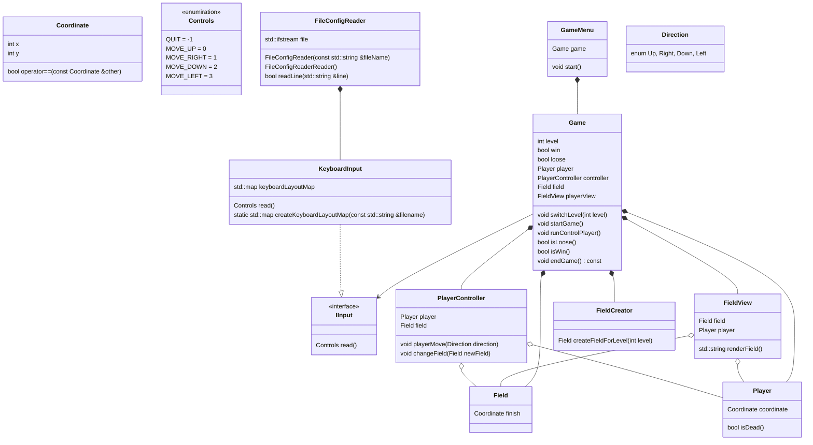

```mermaid
classDiagram
    class Coordinate {
        int x
        int y
        bool operator==(const Coordinate &other)
    }

    class Controls {
        <<enumiration>>
        QUIT = -1
        MOVE_UP = 0
        MOVE_RIGHT = 1
        MOVE_DOWN = 2
        MOVE_LEFT = 3
        }


    class IInput {
        <<interface>>
        Controls read()
    }

    class KeyboardInput {
        std::map<int, Controls> keyboardLayoutMap
        Controls read()
        static std::map<int, Controls> createKeyboardLayoutMap(const std::string &filename)
    }

    class FileConfigReader {
        std::ifstream file
        FileConfigReader(const std::string &fileName)
        FileConfigReaderReader()
        bool readLine(std::string &line)
    }

    class Player {
        Coordinate coordinate
        bool isDead()
    }

    class Field {
        Coordinate finish
    }

    class PlayerController {
        Player player
        Field field
        void playerMove(Direction direction)
        void changeField(Field newField)
    }

    class FieldView {
        Field field
        Player player
        std::string renderField()
    }

    class Game {
        int level
        bool win
        bool loose
        Player player
        PlayerController controller
        Field field
        FieldView playerView
        void switchLevel(int level)
        void startGame()
        void runControlPlayer()
        bool isLoose()
        bool isWin()
        void endGame() const
    }

    class GameMenu {
        Game game
        void start()
    }

    class Direction {
        enum  Up, Right, Down, Left
    }

    class FieldCreator {
        Field createFieldForLevel(int level)
    }

    KeyboardInput ..|> IInput
    FileConfigReader *-- KeyboardInput
    PlayerController o-- Field
    PlayerController o-- Player
    FieldView o-- Player
    FieldView o-- Field
    Game *-- PlayerController
    Game *-- FieldView
    Game *-- FieldCreator
    Game *-- Player
    Game *-- Field
    GameMenu *-- Game
    Game --> IInput
```